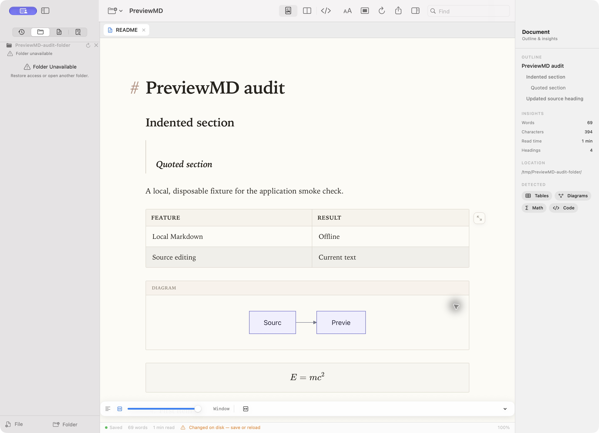
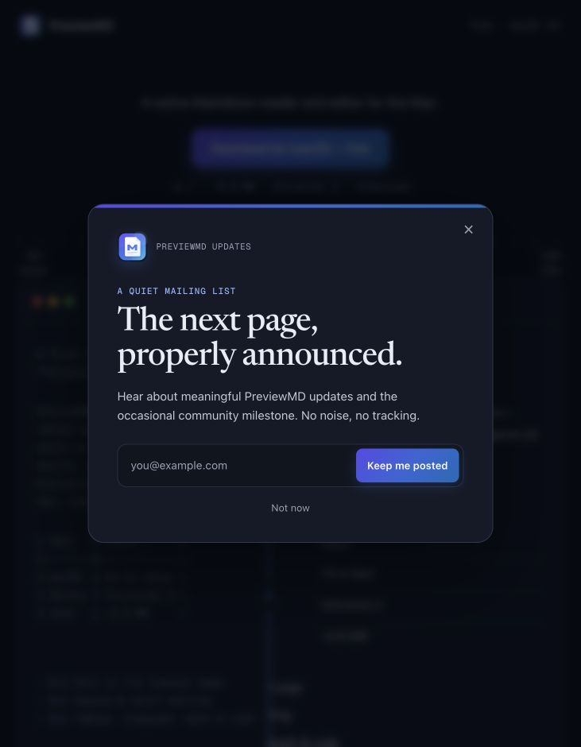

# Document and workspace regression audit

The October 2026 audit prioritizes document integrity, then editing latency,
workspace consistency, export structure, and signup lifecycle. Each fix is
covered by a focused regression rather than a snapshot of the implementation.

| Problem | Repair and regression coverage |
| --- | --- |
| PDF/printing used an earlier rich-edit snapshot and restored old text | Flush current edits before export; preserve current content, layout, and reading position on restoration. `RendererAuditTests` checks actual PDF text and restored editor content. |
| An unrelated rich edit collapsed blank lines inside code and metadata | Normalize separators between blocks only. `EditorSerializationRegressionTests` covers code, frontmatter, and copied fragments. |
| Literal paragraph markers became headings, quotes, lists, or strikeout | Escape paragraph syntax in context while preserving deliberate formatting. Serialization tests round-trip literal markers and inline-code spaces. |
| Atomic saves replaced symbolic links instead of updating their targets | Resolve the destination before replacement and use one document tab per canonical path. `DocumentStateRegressionTests` checks target/link integrity and Save As conflicts. |
| Inspector headings disagreed with the rendered document | Use the bundled parser's heading grammar and rendered IDs; publish rich changes after their content update. Renderer and bridge-order tests cover Setext headings, indentation, nested quotes, and long fences. |
| Folder search retained discarded or moved in-memory content | Refresh after close, reload, and Save As. Document-state tests verify results against the remaining tabs and disk. |
| Missing folders repeatedly opened background error dialogs | Keep a recoverable inline folder status; automatic checks avoid modal alerts. Tests cover disappearance and recovery. |
| DOCX ordered lists ignored starts and independent restarts | Give each list its own numbering instance and level-specific start override. `DOCXDocumentWriterTests` inspects document and numbering XML, including nested lists and zero starts. |
| A previous signup request or timer changed a reopened form | Abort requests, guard generations, cancel timers, and reset on dismissal. `Tests/Site/signup.test.cjs` exercises delayed success/failure and queued native close events against the actual signup code. |
| Packaging could copy an old product after a successful build with a newer SwiftPM | Ask SwiftPM for the output directory with the same build options and verify both architectures before packaging. Also keep the linked SDK separate from the deployment target and validate both in each executable slice. CI builds and verifies the complete bundle. |

## GitHub reports

- [#24: large-document input lag](https://github.com/ashtree74/PreviewMD/issues/24):
  source highlighting recolors the affected logical lines and keeps full
  passes for changes to code-fence boundaries. Rich serialization caches unchanged
  blocks; split position work runs only when needed. Source-only edits defer
  hidden DOM rebuilding, and disk fingerprints/diffs run away from the main
  actor. Export and visible-editor flushes synchronize pending rendering before
  using the WebView.
- [PR #25](https://github.com/ashtree74/PreviewMD/pull/25) identifies the reading
  width transition race. Observe actual width changes and coalesce relayout on
  animation frames, including the final transition width.
- [PR #26](https://github.com/ashtree74/PreviewMD/pull/26) identifies the leading
  gutter overflow. Account for that gutter in the wide table sizer's width.
  The report and CSS correction are credited to **jedrzejsieracki**.
- [#27](https://github.com/ashtree74/PreviewMD/issues/27) proposes a different
  expanded-table width policy. It remains a product decision; these fixes
  preserve the existing expansion policy.
- [#22](https://github.com/ashtree74/PreviewMD/issues/22) and
  [PR #28](https://github.com/ashtree74/PreviewMD/pull/28) concern the Windows
  port and are independent of the macOS regressions.

## Performance evidence and limits

On the public #24 attachment (126,669 UTF-16 units, 276 rendered top-level
blocks), focused before/after harnesses measured:

| Operation | Before | After |
| --- | --- | --- |
| Native source highlighting, median of ten single-character insertions | 9.32 ms | 2.17 ms |
| Rich serialization flush after the first cache fill | 6–8 ms | 0–1 ms |
| First rich flush with a cold cache | 11 ms | 5 ms |

These are component timings on macOS 27, not end-to-end keystroke latency.
The source harness excludes window layout; the rich harness excludes the
native bridge and uses a 1 ms timer. The report stays open for confirmation of
the complete user workflow on the reporter's Mac.

## Verification

```bash
swift test
python3 -m unittest discover -s site -p 'test_*.py'
node --test Tests/Site/signup.test.cjs
./scripts/build-app.sh
```

Use the complete bundle for UI smoke checks and verify both executables with
`lipo -info`. Check initial empty state, source/document/split transitions,
inspector navigation, focus-mode restoration, and offline showcase rendering.
On the site, opening signup must focus the static heading without a focus ring;
deliberate keyboard navigation must visibly focus interactive controls.

Verified locally on October 6, 2026:

- 174 Swift tests passed (169 XCTest and 5 Swift Testing); the eight workspace
  layout tests also passed after the final folder-status presentation changes.
- 9 server tests and 8 signup lifecycle tests passed.
- The current application and embedded Quick Look executable both contain
  `arm64` and `x86_64`, target macOS 14, and pass strict signature verification.
  Bundled renderer sources match the current checkout.
- Live application checks covered the initial empty state, opening a folder
  without opening its documents, current source saves, matching preview and
  outline headings, split/focus restoration, final-tab closure, and nonmodal
  folder disappearance/recovery in the tree and search views.
- Live site checks covered download-triggered signup, static initial focus,
  visible keyboard focus, and clean dismissal/reopening.

Visual evidence uses disposable test content. The folder-status capture below
predates the SDK correction described next; the corrected native-layout capture
shows the final appearance.





## Native appearance regression caught after the audit

The first current-product bundle had `minOS 14.0 / SDK 14.0` in both application
slices, while the previous installed application had `minOS 14.0 / SDK 26.5`.
Its source was compiled with SDK 27.0, but Swift Build's isolated linker
environment emitted the deployment version as the linked SDK. This changed
native sidebar/toolbar styling and stretched the reading-width panel across
the preview. Sidebar controls and the panel's view code had not changed.

The build now passes the selected SDK explicitly and supplies the complete
linker platform tuple: macOS, minimum 14.0, and the selected SDK version. It
selects Swift Build when available, using its Swift driver forwarding; older
toolchains use the Xcode backend with clang's forwarding syntax. This prevents
differences between the Xcode 26 and 27 defaults from changing linker arguments.
It validates `LC_BUILD_VERSION` plus both architectures before replacing the
application and after building Quick Look. The selected SDK version comes from
its own metadata, including when `PREVIEWMD_SDKROOT` is supplied.

The rebuilt application and extension both report `minOS 14.0 / SDK 27.0` and
pass strict signature verification. Live comparison confirms the system
sidebar/toolbar appearance and compact centered reading-width panel are
restored, including Focus entry and Escape restoration. Apple describes this
SDK-dependent adoption of native appearance in
[Adopting Liquid Glass](https://developer.apple.com/documentation/technologyoverviews/adopting-liquid-glass).


## Follow-up order

1. Confirm the full large-document editing workflow with the reporter of #24;
   the measured component improvements alone do not close that report.
2. Decide the expanded-table width policy proposed in #27 and give any changed
   policy its own regression coverage.
3. Review the independent Windows work in #22 / PR #28 separately from the
   supported macOS application.

The audit's initial local build was ad-hoc signed. The final maintainer release
is PreviewMD 1.8 (12), signed with Developer ID and Hardened Runtime. Apple
accepted both the application and final DMG; each has a stapled ticket and
passes Gatekeeper as `Notarized Developer ID`. The application inside the final
read-only DMG was checked independently for signatures, versions, architectures,
SDK metadata, bundled offline resources, licenses, and installation layout.

The distributable DMG is tracked in `site/`, with matching download/version
metadata and a bumped JavaScript cache key. Submission IDs, artifact sizes and
SHA-256 digests are recorded in
[the release receipt](releases/PreviewMD-1.8-12.json). Production website
deployment remains separate.
